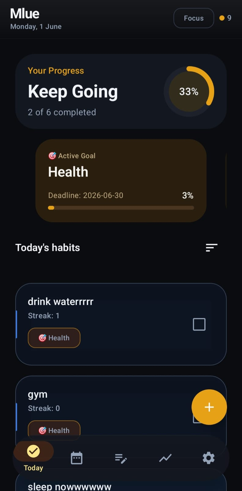
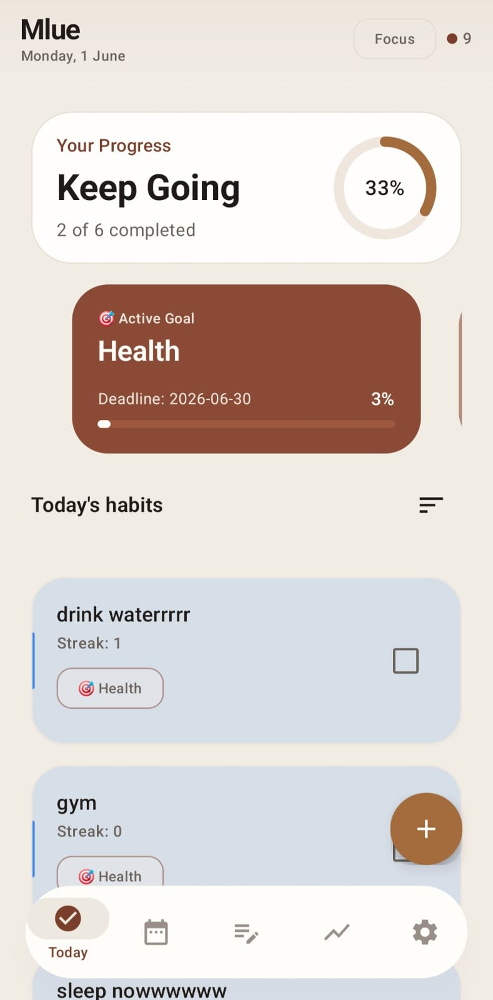
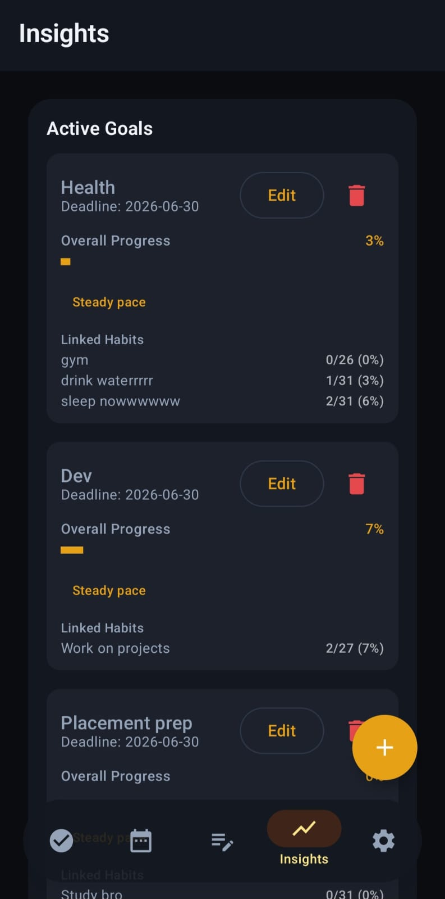
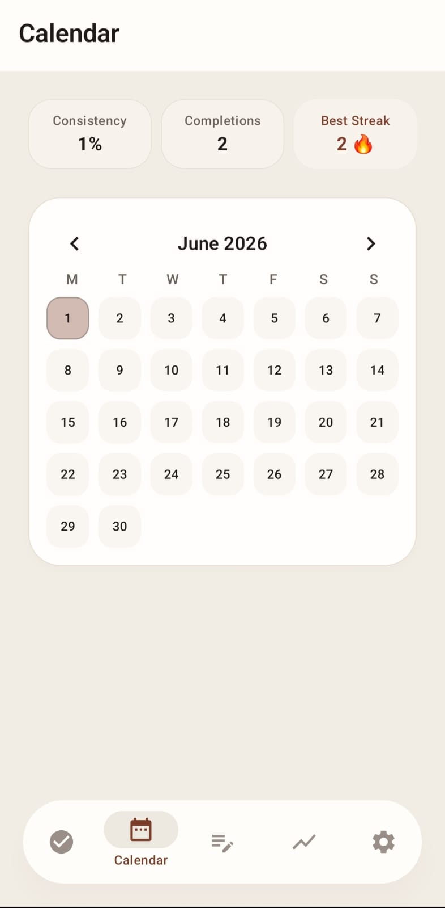
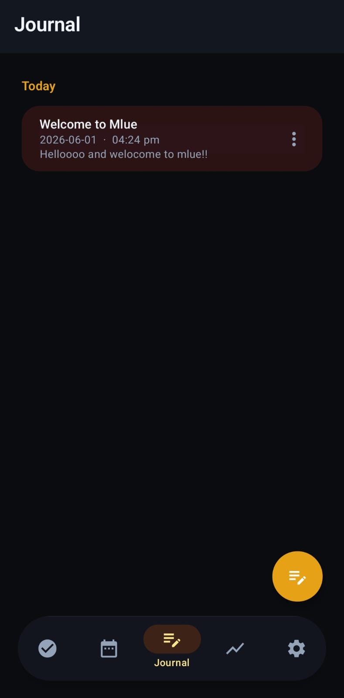
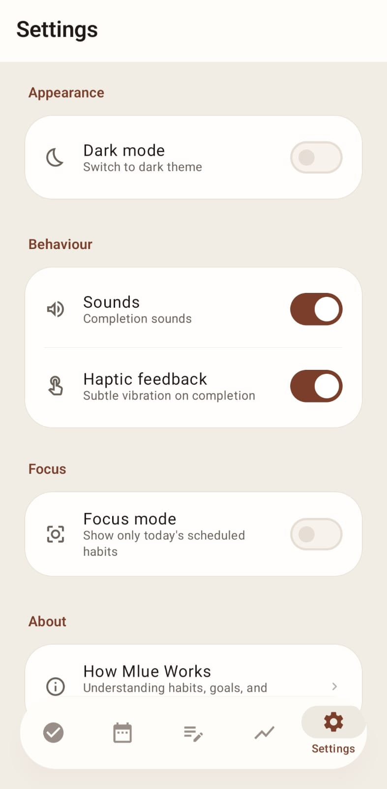

# Mlue

> A quiet habit companion. No account. No tracking. Just you.


---

## Philosophy

Most habit apps are built around pressure.  
Mlue is built around patience.

It doesn't judge whether you missed a day. It doesn't gamify your routines or reward you with streaks to protect. It simply exists to help you notice — quietly, honestly — how you're spending your time.

Mlue believes that small, repeated actions matter more than any single burst of effort.  
And that the best tool for building habits is one you actually trust.

---

## Screenshots

<div align="center">
  
  
  
</div>

<br>

<div align="center">
  
  
  
</div>

---

## Features

- **Daily habit tracking** — Create habits, mark them done, watch patterns emerge over time
- **Goals** — Group related habits under a shared intention, not a finish line
- **Insights** — Gentle observations about your natural rhythms, not performance grades
- **Journal** — An optional, private space for brief daily reflection
- **Focus Mode** — Narrow your view to what genuinely needs attention today
- **Reminders** — Precise, battery-respectful alarms using Android's AlarmManager
- **Offline-first** — Works without a network connection, always

---

## Offline-first & Privacy

Mlue stores everything locally, on your device.

- **No account required.** You don't need to sign up for anything.
- **No cloud sync.** Your data never leaves your phone.
- **No analytics SDKs.** Mlue doesn't phone home.
- **No advertising identifiers.** Your habits are your business.
- **No telemetry.** We have no idea how you use the app, and that's intentional.

Crash diagnostics, if any, surface through Android Vitals — an OS-level, anonymized service you can opt out of at the device level. That's it.

Mlue was designed to be a tool you trust, not a platform that studies you.

---

## How Mlue Works

**Habits** are small, repeatable actions. Create one, set an optional reminder, and mark it done each day.

**Goals** give habits a shared direction. Group related habits — like "Sleep Better" or "Move More" — to track broader progress without losing sight of the details.

**Insights** appear as your routines develop. They surface trends quietly — a best day, a natural streak, a shift in your patterns. Observations, not grades.

**Journal** is entirely optional and private. A sentence or two each day is more than enough.

**Focus Mode** reduces noise when your full list feels overwhelming. It surfaces what matters most today.

---

## Tech Stack

| Layer | Technology |
|-------|-----------|
| Language | Kotlin |
| UI | Jetpack Compose + Material 3 |
| Database | Room (SQLite) |
| Preferences | DataStore |
| Reminders | AlarmManager (exact alarms, Doze-aware) |
| Background | WorkManager |
| Architecture | MVVM + Repository pattern |

---

## Architecture

Mlue follows a clean MVVM structure:

```
app/
├── data/          # Room database, DAOs, DataStore, Repository
├── reminders/     # AlarmManager scheduling, BroadcastReceivers
├── ui/
│   ├── components/  # Reusable Compose components
│   ├── screens/     # Feature screens (Home, Journal, Stats, etc.)
│   └── theme/       # Material 3 theming, typography, color
└── viewmodel/     # State management, business logic
```

Key design decisions:
- All scheduling is transactional — reminders survive process death and device reboots via `BootReceiver`
- Temporal truth is always derived from the database, never from local date comparisons
- State restoration uses `rememberSaveable` with safe Parcelable types only
- R8 minification is enabled in release builds with explicit ProGuard rules for Room, DataStore, and Coroutines

---

## Getting Started

**Requirements**
- Android Studio Hedgehog or later
- Android device or emulator running API 24+

**Build**
```bash
git clone https://github.com/sha19hank/Mlue.git
cd Mlue
./gradlew assembleDebug
```

Or open the project in Android Studio and run the `app` configuration directly.

---

## Roadmap

Mlue is in closed beta. Post-beta considerations include:

- [ ] Home screen widget
- [ ] Optional data export (CSV / JSON)
- [ ] Habit templates
- [ ] Localization support

Features will be added slowly and intentionally.  
Mlue's value is in what it *doesn't* do as much as what it does.

---

## Contributing

Contributions are welcome. Please read [CONTRIBUTING.md](CONTRIBUTING.md) before opening a pull request.

Keep changes focused. Respect the existing architecture. Discuss significant changes before implementing them.

---

## License

MIT — see [LICENSE](LICENSE) for full text.
